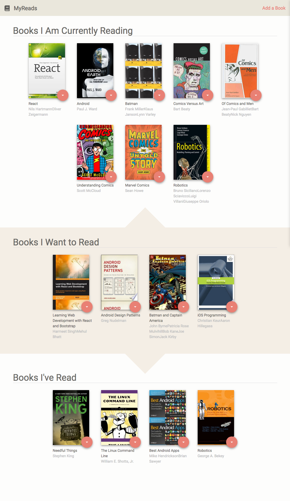
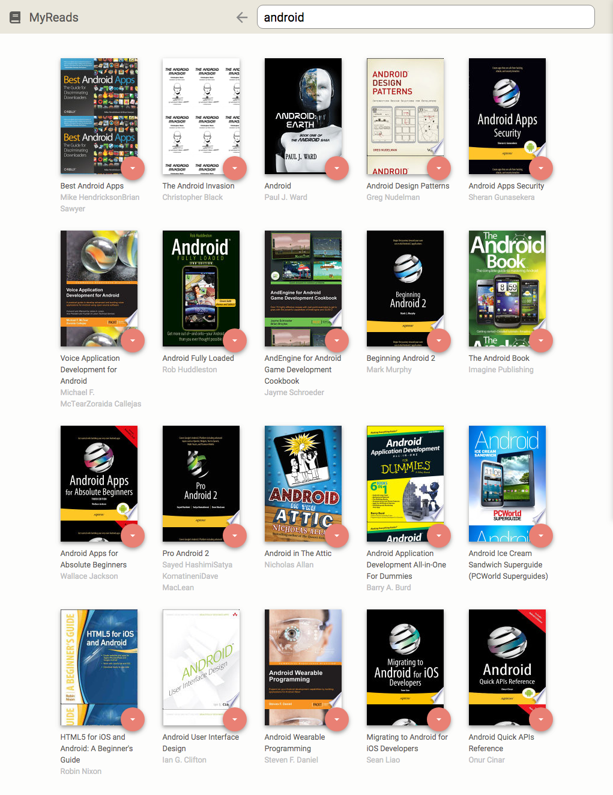

# MyReads Project

This is the first project in the Udacity React Nanodegree. This react app is a bookshelf to track books you are reading, have read, or want to read. It allows you to search and add books and also move the books to different shelves by using the dropdown on each book.

## To use this project:

* install all project dependencies with `npm install`
* start the development server with `npm start`

### Home Page Image

### Add a Book / Search Page Image. Existing books on your shelves are highlighted.

